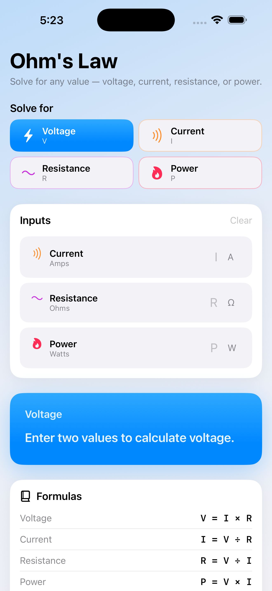
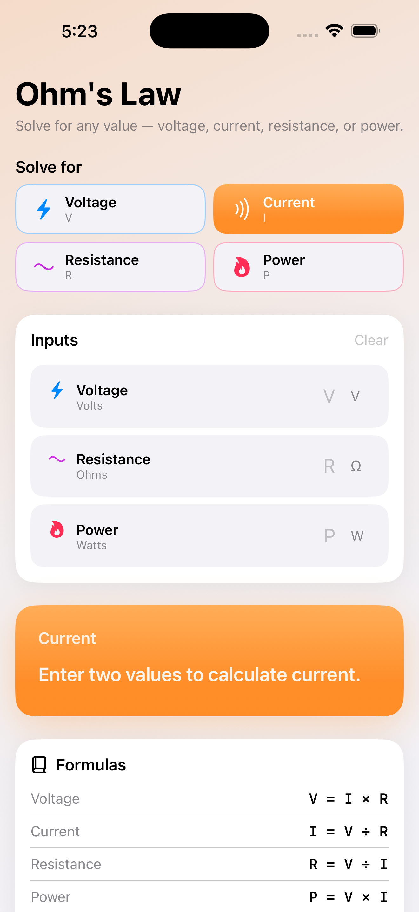
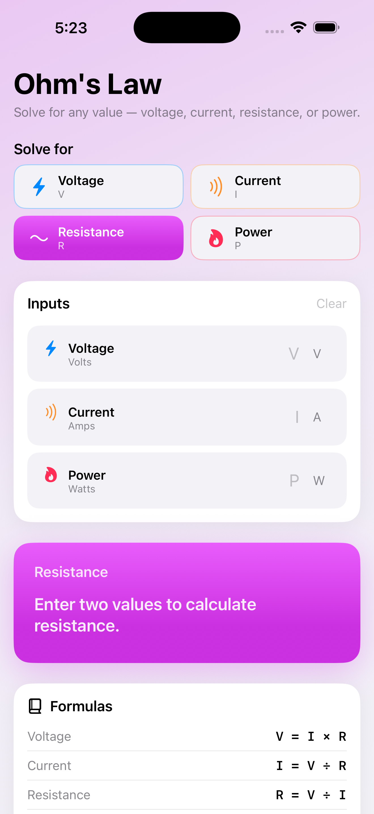
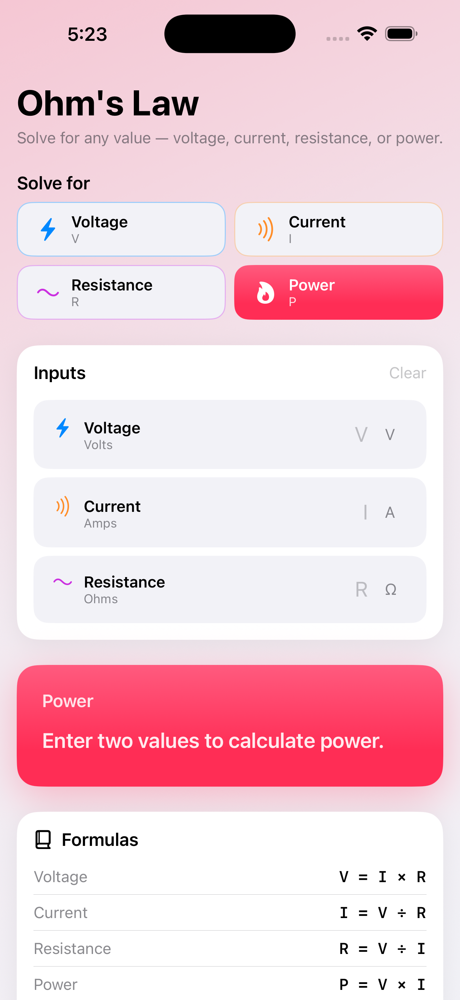
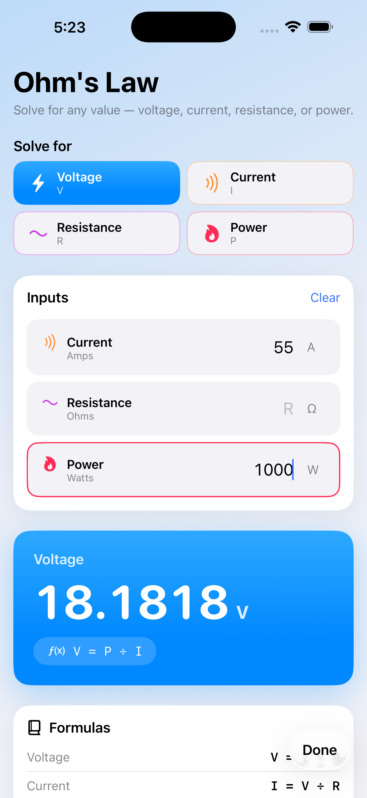
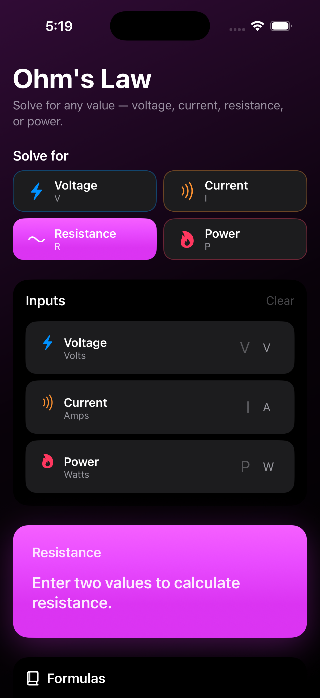
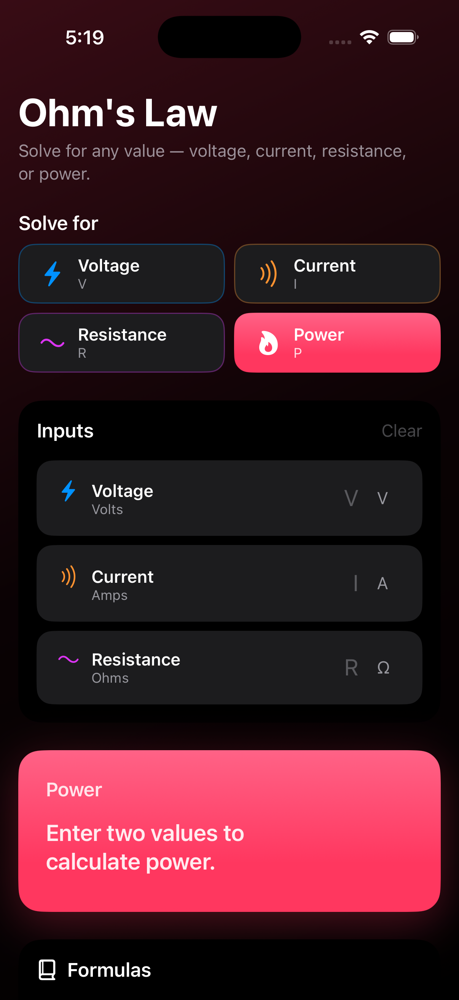

# Ohm's Law Calculator

A native iOS app, written in SwiftUI, for solving Ohm's Law and power equations.

Pick which value you want to solve for — **voltage, current, resistance, or power** — enter the values you know, and the result updates instantly with the formula used.

## Screenshots

<details>
<summary><b>Light mode</b> — tap to expand</summary>

<br>

<p align="center">
  
  
  
</p>
<p align="center">
  
  
</p>

</details>

<details>
<summary><b>Dark mode</b> — tap to expand</summary>

<br>

<p align="center">
  
  
</p>

</details>

## Features

- Solve for any of V, I, R, or P from any two known values
- Animated, color-coded result card with the formula displayed
- Numeric keypad input with monospaced digits
- Dynamic Type and VoiceOver friendly
- Reference list of all Ohm's Law and power formulas

## Requirements

- Xcode 16 or later
- iOS 17.0+
- Swift 5+

## Build

```sh
open OhmsLawCalculator.xcodeproj
```

Or from the command line:

```sh
xcodebuild -project OhmsLawCalculator.xcodeproj \
           -scheme OhmsLawCalculator \
           -destination 'platform=iOS Simulator,name=iPhone 17' \
           build
```

## Formulas

| Solve for  | Formula        |
|------------|----------------|
| Voltage    | `V = I × R`    |
| Current    | `I = V ÷ R`    |
| Resistance | `R = V ÷ I`    |
| Power      | `P = V × I`    |
| Power      | `P = I² × R`   |
| Power      | `P = V² ÷ R`   |

## Project layout

```
OhmsLawCalculator/
├── OhmsLawCalculatorApp.swift   App entry point
├── Models/                       OhmsCalculator, OhmVariable, OhmResult, FormulaEntry
├── DesignSystem/                 Theme tokens, gradient background
├── Views/                        CalculatorView and subviews
├── Assets.xcassets               App icon, accent color
└── Preview Content/              Preview-only assets
```

The original React Native version lives under `archived/`.
